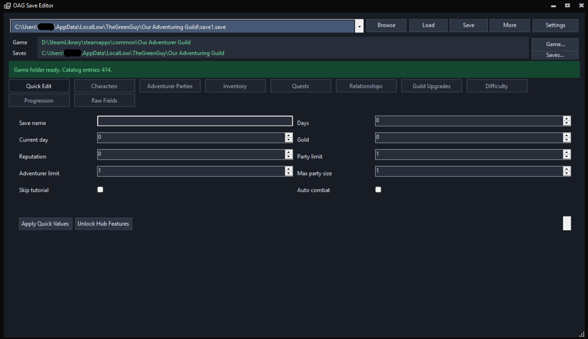
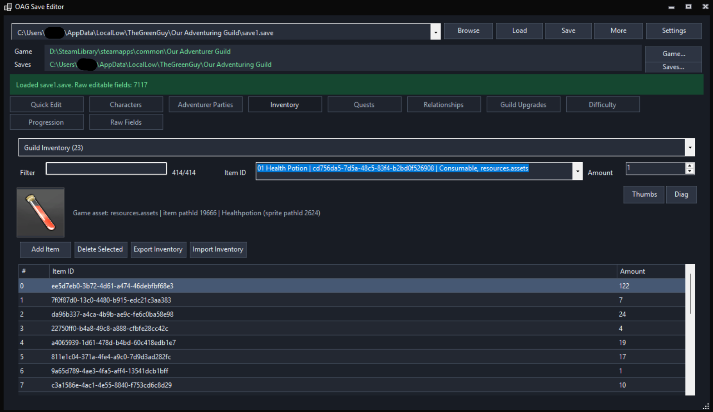
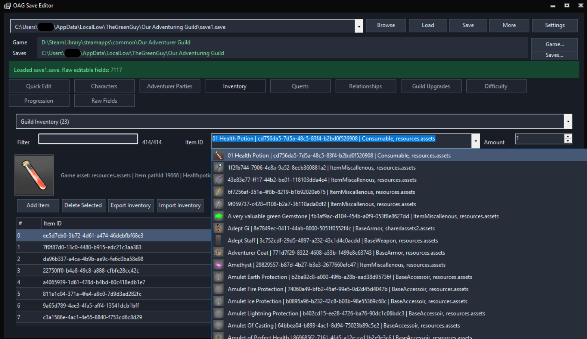
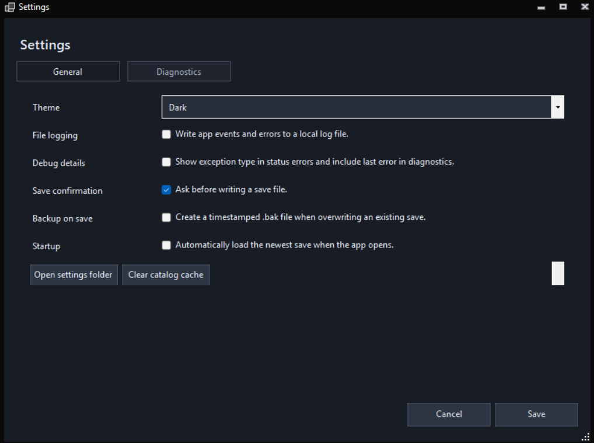

# Our Adventurer Guild Save Editor

Windows x64 binary distribution for the Our Adventurer Guild Save Editor.

## Download And Run

1. Download the repository as a ZIP file or clone it.
2. Open `OagSaveEditor`.
3. Run `OagSaveEditor.exe`.

The app is published as a self-contained Windows build, so users don't need to install the .NET runtime separately.

## Load A Save File

1. Start the app and confirm the `Game` and `Saves` paths are correct. Use `Game...` or `Saves...` if you need to choose different folders.
2. Pick a save from the top dropdown, or click `Browse` and select a `.save` file manually.
3. Click `Load`. After editing, click `Save` to overwrite the loaded save or `More` -> `Save As...` to write a copy.

Default saves are usually under `%USERPROFILE%\AppData\LocalLow\TheGreenGuy\Our Adventuring Guild`.

## Screenshots

| Quick Edit | Inventory |
| --- | --- |
|  |  |

| Item List | Settings |
| --- | --- |
|  |  |

## Notes

- The editor works with local save files only.
- Create or keep backups before editing saves (App has auto backup feature).
- Feel free to report bugs.
