# Our Adventurer Guild Save Editor

Windows x64 binary distribution for the Our Adventurer Guild Save Editor.

## Download And Run

1. Download the repository as a ZIP file, clone it or download from Release.
2. Open `OagSaveEditor`.
3. Run `OagSaveEditor.exe`.

The app is published as a self-contained Windows build, so users don't need to install the .NET runtime separately.

## Load A Save File

1. Start the app and confirm the `Game` and `Saves` paths are correct. Use `Game...` or `Saves...` if you need to choose different folders.
2. Pick a save from the top dropdown, or click `Browse` and select a `.save` file manually.
3. Click `Load`. After editing, click `Save` to overwrite the loaded save or `More` -> `Save As...` to write a copy.

Default saves are usually under `%USERPROFILE%\AppData\LocalLow\TheGreenGuy\Our Adventuring Guild`.

## Screenshots

Click a screenshot to view it at full size.

### Save Editor

| Quick Edit | Inventory Search |
| --- | --- |
| [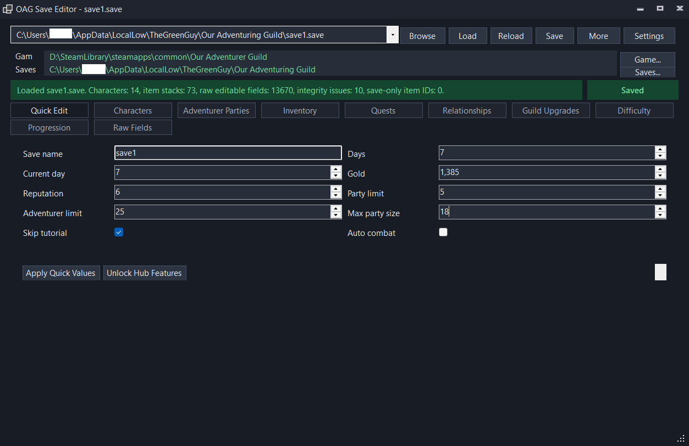](docs/images/quick-edit.png) | [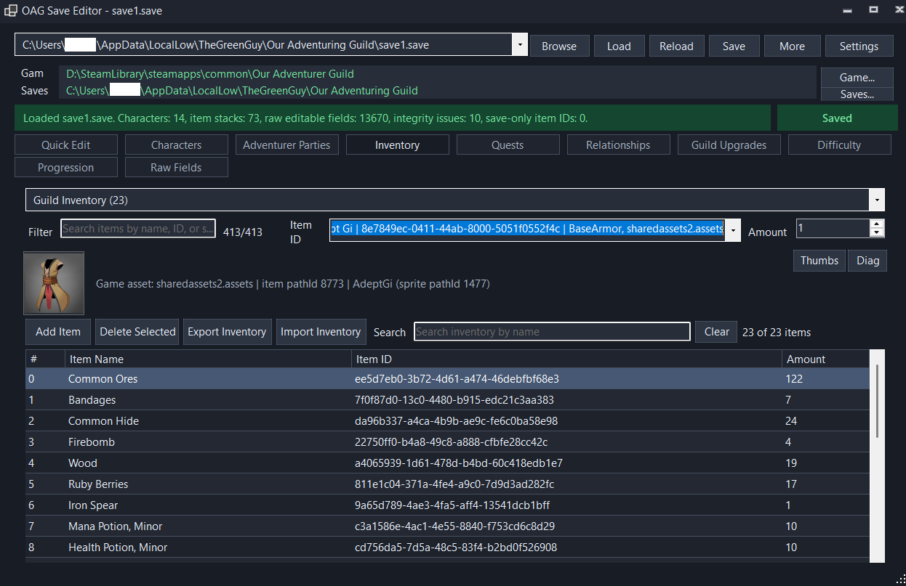](docs/images/inventory.png) |

| Item Catalog | Game Mod Options |
| --- | --- |
| [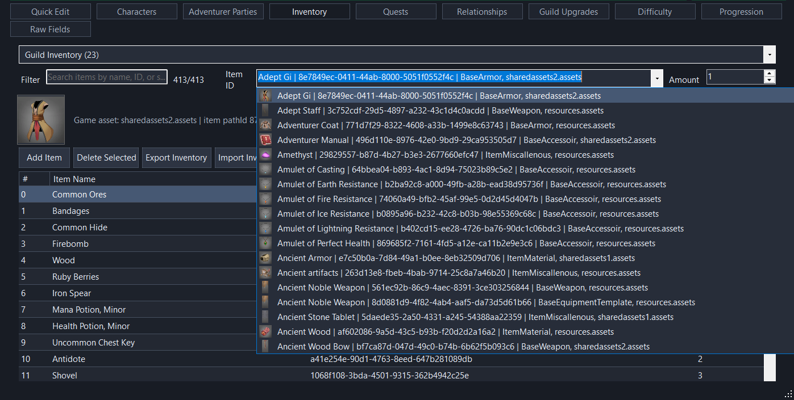](docs/images/item-list.png) | [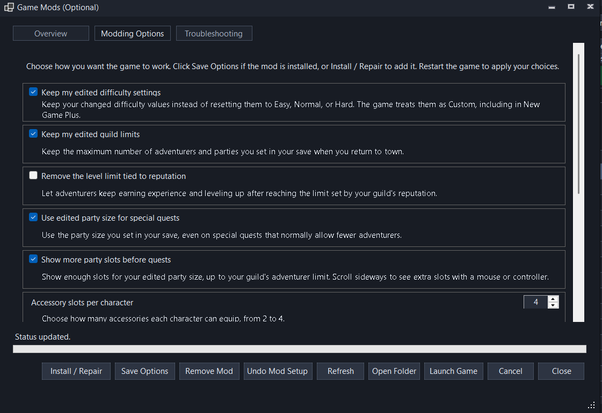](docs/images/mod-options.png) |

### In-Game Mod Features

The optional game mod adds the in-game features shown below.

**Cheat Menu**

[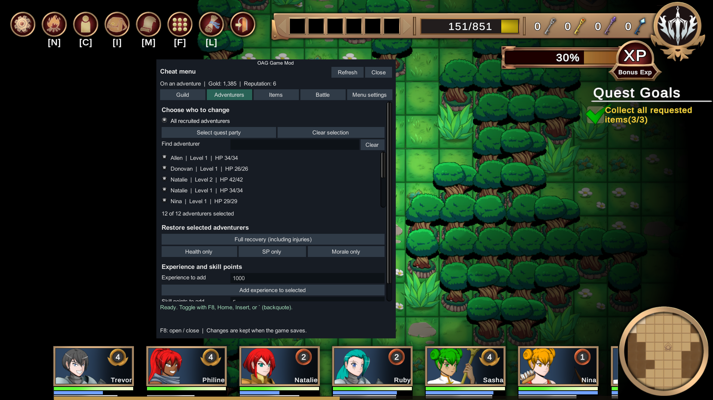](docs/images/cheat-menu.png)

| Expanded Party Selection | Party Formation |
| --- | --- |
| [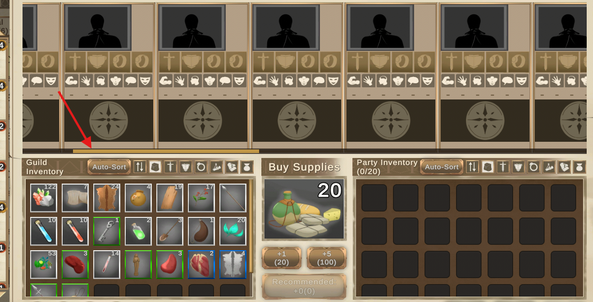](docs/images/party-selection.png) | [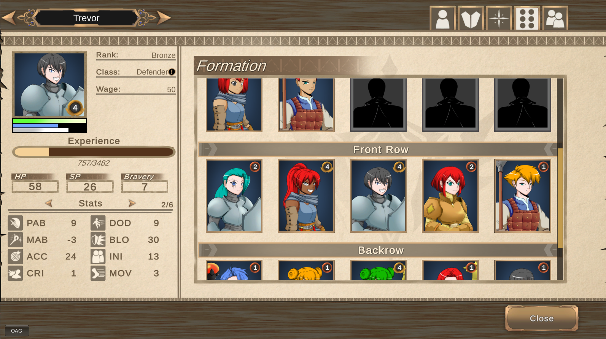](docs/images/party-formation.png) |

| Larger Party in Battle | Battle Turn View |
| --- | --- |
| [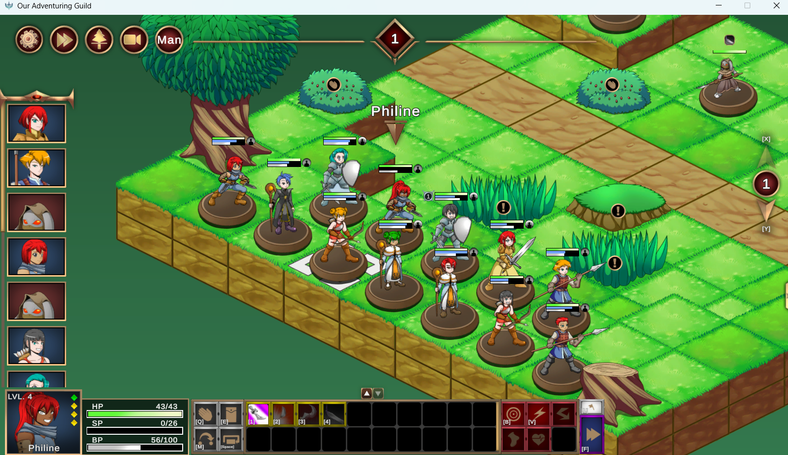](docs/images/battle-1.png) | [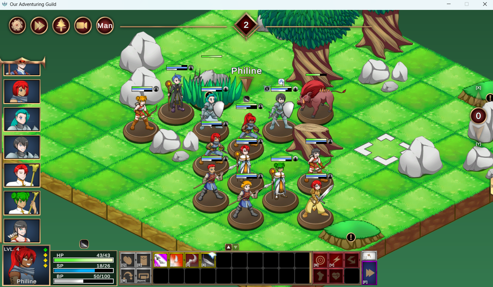](docs/images/battle-2.png) |

| Equipment and Inventory | Experience Screen |
| --- | --- |
| [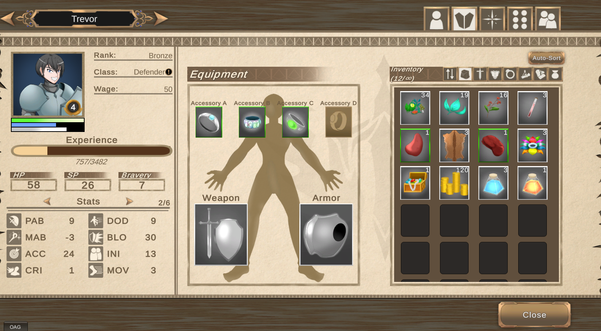](docs/images/equipment-inventory.png) | [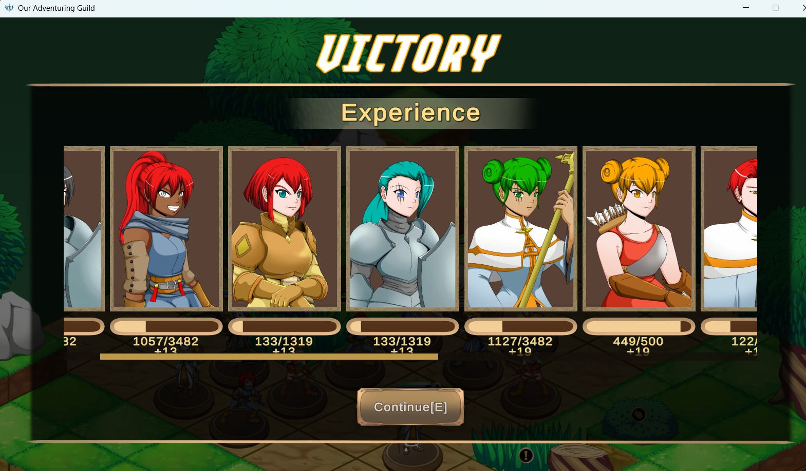](docs/images/experience.png) |

## Notes

- The editor works with local save files only.
- Create or keep backups before editing saves (App has auto backup feature).
- Feel free to report bugs.
